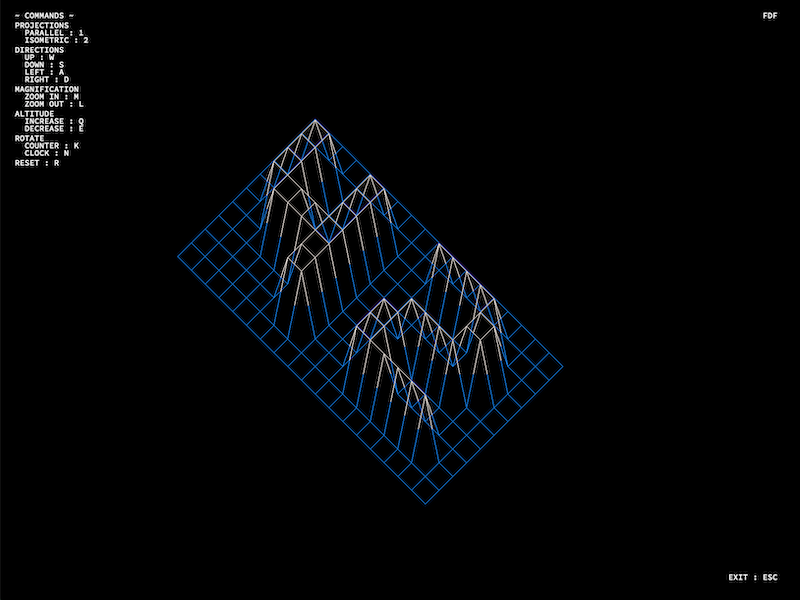
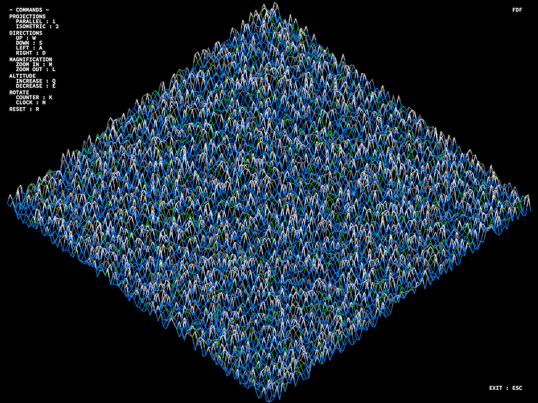

# FDF

This project is about creating a simplified 3D graphic representation of a relief landscape.

## INSTALLATION
Run make inside the repo.
```
$ make path/to/repo
```

## LAUNCHING PROGRAM
The program takes an file that contains a map constructed of numbers (equal in length for each line), with a minimun of two lines, the map can be given both negative and positive values for a point on the map, and `0` indicates no altitude. The given color is based off of the altitude given, for example a negative altitude is blue indicating water. 
```
$ ./fdf name_of_map
```

## FEATURES
- Color gradient
- Two projections: parallel and isometric
- Live map movement
- Modify map magnification and altitudes 
- Rotation of maps

Live-action interation including all features with the pyramid map.
# 

An example of a small map zoomed in and in isometric projection (42).
# 

Another example of a larger map in isometric projection (100-6).
# 
